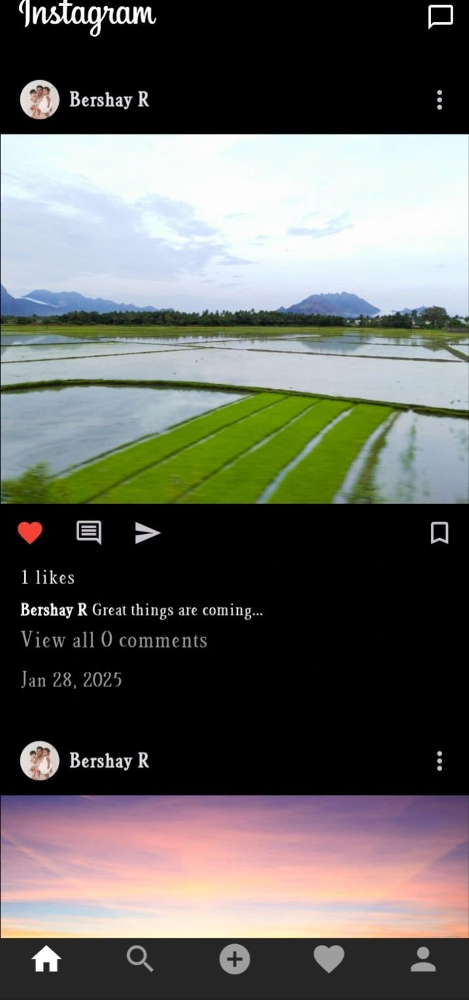
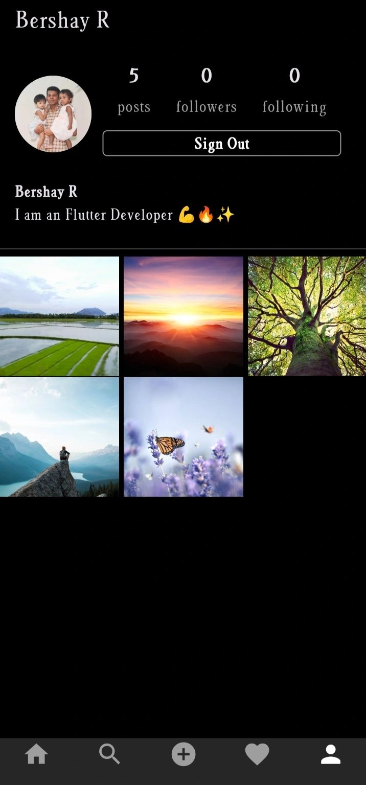

<!-- Screenshots -->

  
  
  

  
  

---

# 📸 Instagram Cloner — Flutter + Firebase (MVVM Architecture)

A feature-rich Instagram-style social media clone developed using Flutter and Firebase, demonstrating real-time updates, cloud integrations, and clean MVVM separation.

---

## 🧾 Project Description

This project emulates the core functionality of Instagram: a feed, user authentication, photo uploads, likes, and comments — all built on a solid MVVM architecture for clean code organization and maintainability. It's ideal for demonstrating full-stack mobile app development using Flutter and Firebase.

---

## ✨ Features

- 🔐 Secure Firebase Authentication (Email/Password)
- 🏠 Dynamic Home Feed with Real-Time Updates
- 📷 Upload Posts (Image + Caption) using Firebase Storage
- ❤️ Like System with Live Counter Updates
- 💬 Commenting System with Firestore Streams
- 👤 User Profile View with Post History
- 🔎 Post Search/Explore Feature
- 🌙 Responsive & Adaptive UI

---

## 🧠 Technical Highlights

- 🧩 Clean MVVM Architecture (Model-View-ViewModel)
- 🔄 Firestore Streams for Real-Time Interactions (posts, likes, comments)
- 📦 Firebase Integration:
  - Firebase Auth
  - Cloud Firestore
  - Firebase Storage
- 🔧 Form Validation and Error Handling
- 💡 Scalable Codebase with Modular Components

---

## 🧰 Tech Stack

| Component         | Technology               |
|------------------|--------------------------|
| Frontend UI      | Flutter                  |
| Backend (BaaS)   | Firebase                 |
| Auth             | Firebase Authentication  |
| Database         | Cloud Firestore          |
| Media Hosting    | Firebase Storage         |
| Architecture     | MVVM                     |
| State Management | setState / ViewModel     |

---

## 🚫 Not Included (By Design)

- Stories / Reels
- Messaging / Chat
- Profile Editing
- Followers System
- Push Notifications

These features were intentionally left out to keep the focus on mastering core Flutter-Firebase interactions and clean architectural practices.

---

## 🤝 Contribution

We welcome contributions from developers of all skill levels!

Steps to contribute:

1. Fork the repository
2. Clone your fork:
   git clone https://github.com/your-username/instagram-cloner.git
3. Create a feature branch:
   git checkout -b feature-name
4. Make your changes
5. Commit:
   git commit -m "Add your feature"
6. Push to your fork:
   git push origin feature-name
7. Create a Pull Request

Please follow proper code formatting and architecture conventions.

---

## 🙏 Thank You!

Thank you for checking out the Instagram Cloner app! Whether you're an HR professional reviewing technical competencies or a developer exploring Firebase + Flutter architecture, I appreciate your interest.

Let’s connect!  
📫 Email: bershayit@gmail.com 
🌐 LinkedIn: https://www.linkedin.com/in/bershayit/
🐙 GitHub: https://github.com/Bershay16

—

Built with ❤️ using Flutter & Firebase.
